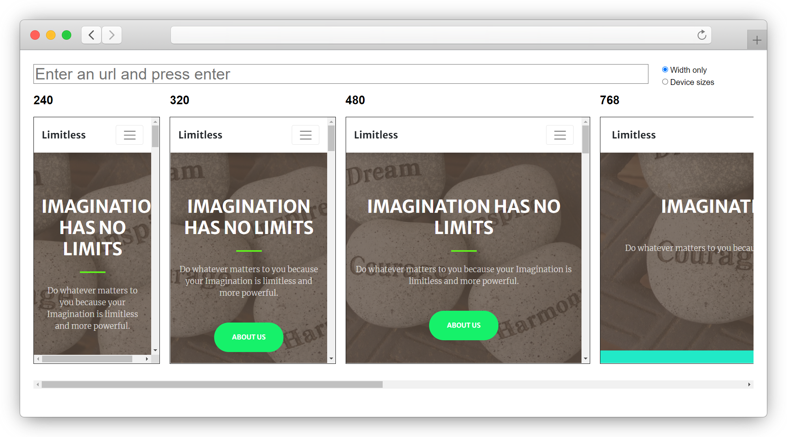

# Responsiveness Tester
- This tool is used for quickly testing any website's design in multiple screen widths.
- Enter the website's URL and test the responsiveness of a specific page in extremely small mobile, mobile, tablet, laptop & desktop views
- You can test websites with SSL (https), websites without SSL (http) and local files (file)
- Demo: https://sivam94.github.io/Responsiveness-tester/

## Screenshots

